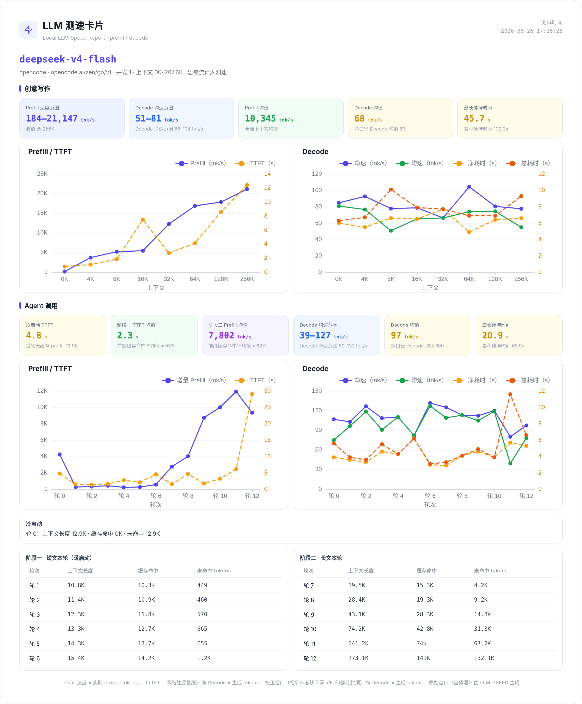
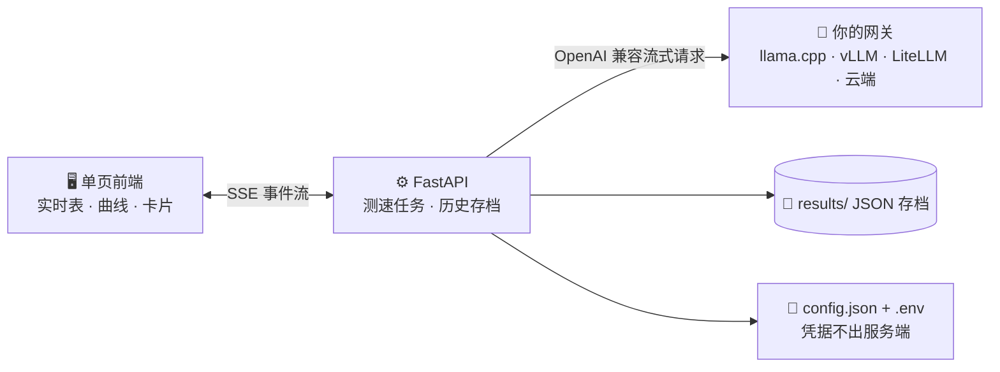

<div align="center">

# ⚡ LLM-SPEED · LLM 测速台

一个 LLM 模型测速台，主打 **数据真实 · 过程可见 · 结论可分享**

**⚡ prefill / decode 分离计量** · **📏 0K~1M 上下文 × 并发** · **🎭 创意写作 · 代码生成 · Agent 连续任务链**

</div>

## 💡 初心

从 vLLM 到 llama.cpp，从 Q4 到 Q8，换卡、调参、比量化，却始终缺一个工具横向回答：
不同上下文长度、不同并发、不同使用场景（创意写作 / 代码生成 / Agent 调用）下，
每个模型的 prefill / decode 到底是多少，与云端 API 的差距是多少。

## ✨ 特点

| 🧮 口径透明 | 📡 逐帧实测 | 🎭 多场景模拟 |
| --- | --- | --- |
| prefill 扣除实测网络往返、decode 按 3 秒滑窗差分、缓存命中逐轮测算、服务端回写校准、异常卡顿显式标记、decode 可选「模板续写」回复模式（高复用改写口径，对齐真实编辑场景的投机采样命中率） | prefill 等待期逐秒给出估值、decode 逐帧刷新；跑完自动生成折线图和测速卡片 PNG，一键分享 | 创意写作读公版《红楼梦》、代码生成读 llama.cpp 真实源码；Agent 调用跑 SWE 多轮连续任务链 |

## 🎙️ 多模态测速（ASR / OCR / TTS）

不止文本生成：同一套测速台覆盖三类媒体模型，全部走 OpenAI 兼容端点、只测速度不测精度——

| 类型 | 端点 | 阶梯 | 核心指标 |
| --- | --- | --- | --- |
| 🎙️ 语音转写（faster-whisper / whisper.cpp / FunASR） | `POST /v1/audio/transcriptions` | 5s ~ 900s 音频 | RTF、倍速、并发吞吐（音频分钟/分钟） |
| 🖼️ 图像识别（Qwen-VL 等 VLM 读图） | chat/completions `image_url` | 1 ~ 16 张/请求 | 单张时延、张/秒、TTFT/decode |
| 🔊 语音合成（Kokoro / GPT-SoVITS / CosyVoice） | `POST /v1/audio/speech` | 50 ~ 3200 字文本 | 首音频字节延迟、RTF、倍速 |

- 在「Provider 管理」给部署加 `"kind": "asr" / "ocr" / "tts"`（缺省 `llm`），模型选择器自动分组、场景只列同类型
- 语料优先用 `corpus/asr/`（wav）、`corpus/ocr/`（png/jpg）下的自有文件，缺省时内置确定性合成语料（零依赖、零体积）
- 测速卡片、并发吞吐、超窗跳档保护对媒体场景同样生效

## 🖼️ 测速卡片示例

| OpenCode Go 云端 · 0K~256K | 本地部署（LiteLLM 网关）· 0K~64K |
| --- | --- |
|  |  |

## 🚀 三分钟上手

**1️⃣ 启动**

```bash
./start.sh        # Linux / macOS；Windows 用 start.bat
```

自动建虚拟环境、装依赖、生成 `.env` 与 `config.json`（从模板）；浏览器打开 http://127.0.0.1:8501。

**2️⃣ 配置** — 顶栏「Provider 管理」抽屉里填好网关与 Key（页面写回 `.env`，永不回显）→「刷新模型列表」勾选模型

**3️⃣ 开测** — 「开始测速」：实时表逐帧刷新 → 完成自动生成测速卡片 → 「下载 PNG」

## 🗺️ 数据流



## 📁 项目结构

```
start.sh / start.bat  一键启动（建虚拟环境、装依赖、生成配置、起服务）
server.py          FastAPI 服务端（provider 解析 + 测速任务 + SSE + 历史 + 配置写入）
bench.py           测速引擎（prompt 构造、流式计时、矩阵调度）
static/index.html  单页前端（ECharts 图表 + html2canvas 卡片 + 配置编辑）
mock_server.py     假 OpenAI 网关（自测）
corpus/            真实语料（code: llama.cpp 源码 / creative: 公版《红楼梦》/ agent: SWE-agent 真实执行轨迹）
scripts/           语料构建脚本（agent 轨迹提取，仅构建期用）
case/              测速卡片示例图（README 引用）
tests/             回归测试
config.json / .env  provider 配置与凭据（不入库）
results/           历次测速结果 JSON
```

## 📄 许可证

本项目以 [Apache License 2.0](LICENSE) 发布。`corpus/` 内为第三方语料：llama.cpp 源码（MIT）、公版《红楼梦》（Project Gutenberg）、SWE-agent 轨迹（CC-BY-4.0），各循其自带许可证。

