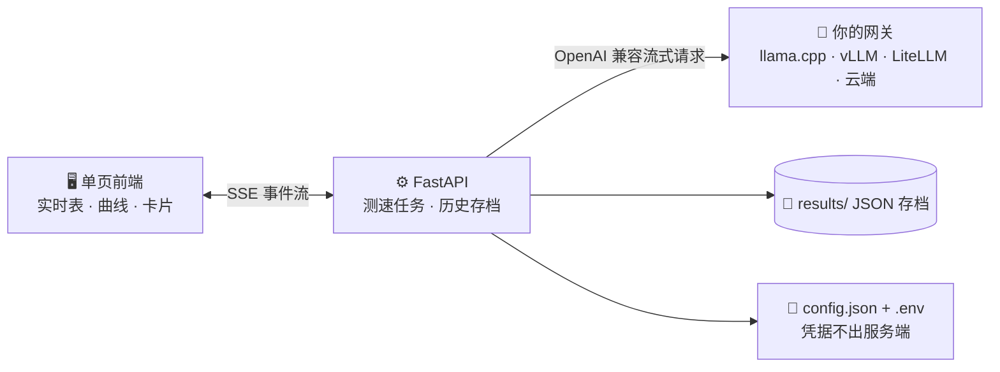

<div align="center">

# ⚡ LLM-SPEED · LLM 测速台

一个 LLM 模型测速台，主打 **数据真实 · 过程可见 · 结论可分享**

**⚡ prefill / decode 分离计量** · **🤖 Agent 调用 · 缓存×指令矩阵** · **🎭 代码生成 / 创意写作 / 多模态**

</div>

## 💡 初心

- **框架五花八门** —— vLLM / llama.cpp / fastllm / Lvllm / ktransformers
- **量化形形色色** —— BF16 / FP8 / NVFP4 / Q8 / Q4
- **场景各有侧重** —— Agent 调用 / 创意写作 / 代码生成 / 翻译 / 图像识别 / 语音识别

本地部署一通折腾，换卡、调参、比量化，**却始终缺一个工具去做横向对比**：

> **从 0K 到 1M 的不同上下文档位，每种模型、每种部署方式，  
> prefill / decode 速度到底能到什么程度，与云端 API 的差距又是多少。**

## ✨ 特点

一套测速台覆盖多类场景

**🧮 场景真实 · 口径透明**
- prefill 扣除实测网络往返，只留纯计算
- decode 点级取首末 token 窗口（实时读数按 3 秒滑窗差分，不被首批突发带跑）
- 前缀缓存命中逐点测算、服务端回写校准、异常卡顿显式标记
- 可选「模板续写」回复模式，对齐真实编辑场景的投机采样命中率

**📡 过程可见 · 逐帧实测**
- prefill 等待期逐秒给出估值，测试不干等
- decode 逐帧刷新，实时速度曲线肉眼可见
- 失败 / 超窗 / 跳档全部留痕，原因可追

**📤 结论可分享 · 一卡带走**
- 跑完自动生成折线图 + 测速卡片 PNG
- 多模型 / 多部署 / 多次运行同图叠加
- 一键下载分享，随时复核

## 🤖 Agent 调用 · 已缓存上下文 × 单步指令测速

Agent的调用形态和普通聊天不一样，**长对话历史早已躺在服务端前缀缓存里，每一轮只追加一条很短的指令**。
真正决定agent「单步反应快不快」的，不是全量上下文的 prefill，而是**增量短指令的 TTFT 与 decode**
普通「按上下文长度测速」答不了这个问题。本项目用模拟 **SWE 轨迹** 重建这种形态，按「已缓存上下文 × 单步指令」矩阵逐点实测：

| 维度 | 默认阶梯（tokens；测速矩阵面板可自定义） |
| --- | --- |
| 🧱 已缓存上下文 | 0 · 4K · 8K · 16K · 32K · 64K · 128K · 256K |
| 📌 单步指令 | 64 · 128 · 256 · 512 · 1K · 2K · 4K · 8K |

默认 8×8 = 每模型 / 每并发 64 个组合点，每个点都复刻真实 agent 循环的四步：

1. **预热写入** — 每档缓存先用一条预热请求把上下文写进服务端前缀缓存；
   预热只求「缓存上」、不计入测点；
2. **单步实测** — 在已缓存上下文上只追加指令消息，量增量 prefill（TTFT）、
   decode 速度与端到端总时长；
3. **零缓存基线** — 同指令先裸跑零缓存档做对照，直接读出「缓存命中 × 指令
   长度」对单步延迟的收益；
4. **指令名实相符** — 真实指令长度按链内差分实测，偏离目标自动校正补测，
   64 档小指令不被固定模板 / 请求框架的开销淹没。

语料来自 SWE-agent 在 SWE-bench 任务上的**真实执行轨迹**（系统提示 + 工具定义
+ issue 任务 + 思考 / 命令 / 观测交替，CC-BY-4.0，内置 `corpus/agent/`）。缓存
命中三态识别：API 回传真值 / 网关剥离命中计数时按「TTFT 相对零缓存档走平」等
三通道判别估算（标 ≈）/ 无迹象显式标注「未回传」，宁缺毋假。

## 🎙️ 多模态测速（ASR / OCR / TTS）

不止文本生成：同一套测速台覆盖三类媒体模型，全部走 OpenAI 兼容端点、只测速度不测精度。
链路与合成语料均已实现并有端到端回归（假网关覆盖三类端点）；**尚未在真实媒体服务上
标定过读数**，首次接入真实后端时请以明细表的原始耗时为准复核。

| 类型 | 端点 | 阶梯 | 核心指标 |
| --- | --- | --- | --- |
| 🎙️ 语音转写（faster-whisper / whisper.cpp / FunASR） | `POST /v1/audio/transcriptions` | 5s ~ 1800s 音频 | RTF、倍速、并发吞吐（音频分钟/分钟） |
| 🖼️ 图像识别（Qwen-VL 等 VLM 读图） | chat/completions `image_url` | 1 ~ 16 张/请求 | 单张时延、张/秒、TTFT/decode |
| 🔊 语音合成（Kokoro / GPT-SoVITS / CosyVoice） | `POST /v1/audio/speech` | 50 ~ 3200 字文本 | 首音频字节延迟、RTF、倍速 |

- 在「Provider 管理」给部署勾选模型类型 `kinds`（`llm` 文本生成为默认；可多选——支持视觉输入的文本模型勾 `llm`+`ocr`），模型选择器自动按能力分组、场景只列匹配类型（一次运行限一种类型；旧单值 `"kind"` 字段仍兼容）
- 图像识别负载固定内置合成文档页（3 种分辨率确定性生成，跨环境读数可比）；语音转写可用 `corpus/asr/`（wav）自有音频（帧级循环截取到目标时长，负载按时长归一），缺省时内置合成（零依赖、零体积）
- 测速卡片、并发吞吐、超窗跳档保护对媒体场景同样生效
- 媒体场景档位可在测速矩阵自定义覆盖（缺省回退默认阶梯；一次运行限一种类型）

## 🖼️ 测速卡片示例

<table>
  <tr>
    <th>官方云端 · DeepSeek-V4-Flash</th>
    <th>本地 · DeepSeek-V4-Flash</th>
  </tr>
  <tr>
    <td></td>
    <td></td>
  </tr>
  <tr>
    <th>本地 · Qwen3.8-27B</th>
    <th>本地 · Qwen3.8-27B 对比测试</th>
  </tr>
  <tr>
    <td></td>
    <td></td>
  </tr>
</table>

## 🚀 三分钟上手

**1️⃣ 启动**

```bash
./start.sh        # Linux / macOS；Windows 用 start.bat
```

自动建虚拟环境、装依赖、生成 `.env` 与 `config.json`（从模板）；浏览器打开 http://127.0.0.1:8501。

**2️⃣ 配置** — 顶栏「Provider 管理」抽屉里填好网关与 Key（页面写回 `.env`，永不回显）→「刷新模型列表」勾选模型

**3️⃣ 开测** — 「开始测速」：实时表逐帧刷新 → 完成自动生成测速卡片 → 「下载 PNG」

> **完全离线可用**：图表库（ECharts / html2canvas）随仓库 vendored 在
> `static/vendor/`，页面不请求任何外部资源，也不需要联网（版本与哈希见该目录
> README）。服务默认只绑 `127.0.0.1`；确需局域网访问时设 `HOST=0.0.0.0`，并在
> `.env` 用 `ALLOWED_HOSTS=<访问用的主机名或IP>` 显式放行（写接口有 Host/同源校验）。

## 🗺️ 数据流



## 📁 项目结构

```
start.sh / start.bat  一键启动（建虚拟环境、装依赖、生成配置、起服务）
server.py          FastAPI 服务端（provider 解析 + 测速任务 + SSE + 历史 + 配置写入）
bench.py           测速引擎（prompt 构造、流式计时、矩阵调度）
static/index.html  单页前端（ECharts 图表 + html2canvas 卡片 + 配置编辑）
static/vendor/     本地 vendored 的图表/卡片库（离线可用；版本与哈希见其 README）
mock_server.py     假 OpenAI 网关（自测）
corpus/            语料：code（llama.cpp 源码）/ creative（公版《红楼梦》）/ agent（SWE-agent 真实执行轨迹）/ asr（自有 wav，可选）
scripts/           语料构建脚本（agent 轨迹提取，仅构建期用）
case/              测速卡片示例图（README 引用）
tests/             回归测试（unittest/pytest）
.github/           CI（pytest + 前端语法/注入门禁）
requirements.txt   运行时依赖（锁定到本机验证过的版本）
requirements-dev.txt  测试依赖（pytest）
config.json / .env  provider 配置与凭据（不入库）
results/           历次测速结果 JSON
```

## 🛠️ 开发与测试

```bash
# 运行时依赖（start.sh / start.bat 会自动装）
pip install -r requirements.txt
# 测试依赖（pytest）
pip install -r requirements-dev.txt

# 回归测试：引擎纯逻辑 + mock 端到端 + 接口契约 + SSE 回放（约 4 分钟）
python -m pytest -q                 # 或 python -m unittest discover -s tests -v

# 前端门禁：内联脚本语法 + 注入防护 + 「无外部资源」（需 node）
bash tests/check_frontend_js.sh

# 前端展示层纯函数单测（提取内联脚本 §pure 区域，零依赖无构建，需 node）
bash tests/run_frontend_pure.sh

# 本地自测用的假网关（无需真实模型）
python mock_server.py               # 缺省 :8901；MOCK_PP / MOCK_TG / MOCK_STALL 等旋钮见文件头
```

改动测量口径后请至少回归主要状态组合（见 `mock_server.py` 文件头的旋钮清单）；
`.env` 与 `config.json` 只存在于本地、不入库，`results/` 同理。

## 📄 许可证

本项目以 [Apache License 2.0](LICENSE) 发布。`corpus/` 内为第三方语料：llama.cpp 源码（MIT）、公版《红楼梦》（Project Gutenberg）、SWE-agent 轨迹（CC-BY-4.0），各循其自带许可证。

